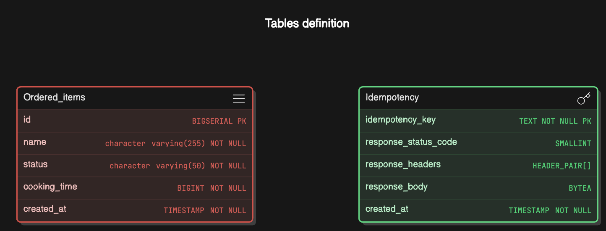

# Simplerestaurant

## Vague requirements
* The server API MUST fully follow REST API principles and present a set of HTTP endpoints to connect to.
* The client (the restaurant staff “devices” making the requests) MUST be able to: add one or more items with a table number, remove an item for a table, and query the items still remaining for a table.
The application MUST, upon creation request, store the item, the table number, and how long the item will take to cook.
* The application MUST, upon deletion request, remove a specified item for a specified table number.
* The application MUST, upon query request, show all items for a specified table number.
* The application MUST, upon query request, show a specified item for a specified table number.
* The application MUST accept at least 10 simultaneous incoming add/remove/query requests.
* The client MAY limit the number of specific tables in its requests to a finite set (at least 100).
* The application MAY assign a length of time for the item to prepare as a random time between 5-15 minutes.
* The application MAY keep the length of time for the item to prepare static (in other words, the time does not have to be counted down in real time, only upon item creation and then removed with the item upon item deletion).


## Functional requirements
* As a serving staff, I’d like to `add` one or multiple items
* As a serving staff, I’d like to `get` all remain items for a specified table
* As a serving staff, I’d like to `get` a specified item (e.g food name) for a specified table. If `there are 2 more items that shares a item name, return all of them`.
* As a serving staff, I’d like to `cancel` an existing item for a specified table

## Non-functional requirements
* When `adding` a new item it should be `idempotent`
* When `canceling` an item, it should be `idempotent`
* Availability > consistency
* Getting all items for a table must be fast 

## Assumptions
* The range of `table` number is an integer between `1 and 100`
* For simplicity purpose, we don't support `quantity` concept when `adding` or `canceling` an order cause it's more by design and we don't want to get distracted from explaining too much business logic
* For simplicity purpose, the endpoint `create a new order one at a time`. It's `client (serving staff) responsibility` to take care of `multiple orders` in a `concurren` way
* For simplicity purpose, the `inputs` and `outputs` are encoded using `json` format
* For simplicity purpose, we can assume the parameters such as `food_name` or `table_num` are already `sanitized`

## RESTful api endpoints
| Verb  | Url  |  Note  | detail |
|-------|------|--------|---|
| POST  |  /items | Add a new order with a specified table1  | [link](#-add-a-new-order) |
| GET  |  /items?table={`table_num`}  | Query all items with a specified table where `table_num` is an integer `between 1 and 100`| [link](#-query-all-items-with-specified-table) |
| GET  |  /items/{`food_name`}?table={`table_num`}  | Query all items with a specified table and a specified item where `table_num` is an `integer` between `1 and 100` and `food_name` is a `string` (ex: noodle, rice ...)| [link](#-query-all-items-with-specified-table-and-specified-food-name) |
| DELETE  | /items  | Cancel an existing order with a specified table |  [link](#-cancel-an-order)  |

# Postgres design
* In previous assumptions, the table ranges from 1 to 100  
* Each table should be `independent` from another table so database can process orders concurrently for different tables
* Therefore, we create 100 schema named from `table1, table2, ..., table100` and for each schema we create 2 tables which are `ordered_items` and `idempotency`


### Tables definition


## Highlights
* This implmenetation focuses more on making it right under `multi-threading` enviroment rather than adding too much business logic
* This implmenetation focuses more on making `adding` or `canceling` order `idempotent`
* This implmenetation focuses more on writing solid tests, error handle, CI and docker
* This implementation uses `sqlx` to crud database using `raw sql` rather than any `orm` tool to meet the homework requirements

## Idempotency


## Multi-threads support
 >The application MUST accept at least 10 simultaneous incoming add/remove/query requests 
Please check the follwing test case   

[concurrent_create_orders](https://github.com/gemhung/simplerestaurant/blob/main/tests/api/orders.rs#L178-L208)

## Tech stack
* rust, actix-web, sqlx, tokio, tracing, serde

# Pre-requisites
* [Rust](https://www.rust-lang.org/learn/get-started)
* Docker
* [bunyan](https://github.com/LukeMathWalker/bunyan)
* [sqlx-cli](https://github.com/launchbadge/sqlx/tree/main/sqlx-cli)
* psql (optional)


# How to run
### MacOS
```bash
# bunyan
cargo install bunyan
```
```bash
# sqlx-cli
cargo install --version="~0.7" sqlx-cli --no-default-features --features rustls,postgres
```

### Launch postgres
```bash
./init_db.sh
```

### Launch `prometheus` and `grafana` for monitoring (optional)
```bash
# Launching dockers
docker-compose -f docker_compose_prometheus_grafana.yaml up -d

# checking grafana
curl localhost:3000

# checking prometheus
curl localhost:9091

# For more information, see https://betterprogramming.pub/monitoring-a-rust-web-application-using-prometheus-and-grafana-3c75d9435dec
```

### Install psql (optional)
```bash
brew install libpq
```
```bash
# Inputs `password` when prompted with entering password
psql -h 0.0.0.0 -p5432 -U postgres restaurant
Password for user postgres:
psql (16.4, server 17.2 (Debian 17.2-1.pgdg120+1))
WARNING: psql major version 16, server major version 17.
         Some psql features might not work.
Type "help" for help.

restaurant=#
```

### Launch application
```bash
cargo run --relase | bunyan
```


## # Add a new order
### simplerestaurant_client
```bash
cargo run --release -p simplerestaurant_client -- order --food "rice:1" | json_pp
```
##### Example output
```json
[
   "rice is added in table 1"
]
```
### cURL
```bash
# `idempotency_key` can be random string or uuid
curl --header "Content-Type: application/json" --request POST --data '{"item_name":"bread","idempotency_key":"some-random-string or uuid","table":2}' http://127.0.0.1:8080/items

```

## # Add multiple orders
### simplerestaurant_client
```bash
cargo run --release -p simplerestaurant_client -- order --food "sushi:3" "curry:4" | json_pp
```

##### Example output
```json
[
   "sushi is added in table 3",
   "curry is added in table 4"
]

```

### cURL
```
# Not supported 
```

## # Query all items with specified table
### simplerestaurant_client
```bash
cargo run --release -p simplerestaurant_client -- query --table 3 | json_pp
```
##### Example output 
```json
[
   {
      "cooking_time" : 636,
      "created_at" : "2024-12-09T06:08:52.471564",
      "id" : 1,
      "name" : "fish",
      "status" : "added"
   },
   {
      "cooking_time" : 468,
      "created_at" : "2024-12-10T03:15:52.540285",
      "id" : 3,
      "name" : "sushi",
      "status" : "added"
   },
   [...]
]
```

### cURL
```bash
# GET /items?table={table_num} 
# where `table_num` is any integer between 1 and 100
curl --request GET --url http://127.0.0.1:8080/items?table=1 | json_pp
```

## # Query all items with specified table and specified food name
### simplerestaurant_client
```bash
cargo run --release -p simplerestaurant_client -- query --table 1 --name rice | json_pp
```
##### Example output
```json
// All items share the name as `rice`
[
   {
      "cooking_time" : 404,
      "created_at" : "2024-12-04T07:14:07.303946",
      "id" : 2,
      "name" : "rice",
      "status" : "added"
   },
   {
      "cooking_time" : 436,
      "created_at" : "2024-12-06T08:06:36.082803",
      "id" : 6,
      "name" : "rice",
      "status" : "added"
   },
   {
      "cooking_time" : 878,
      "created_at" : "2024-12-10T03:19:59.243742",
      "id" : 10,
      "name" : "rice",
      "status" : "added"
   }
]

```
### cURL
```bash
# GET /items/{food_name}?table={table_num} 
# where `food_name` is any string 
# and `table_num` is any integer between 1 and 100
curl --request GET --url http://127.0.0.1:8080/items/noodle?table=1 | json_pp
```

## # Cancel an order
### simplerestaurant_client
```json
// Query all items with specified table beforehand to find the `item-id` to cancel
[
   {
      "cooking_time" : 636,
      "created_at" : "2024-12-09T06:08:52.471564",
      "id" : 1,    // <---- Let's it's the `item-id` we'd like to cancel !
      "name" : "fish",
      "status" : "added"
   },
   {
      "cooking_time" : 468,
      "created_at" : "2024-12-10T03:15:52.540285",
      "id" : 3,
      "name" : "sushi",
      "status" : "added"
   },
   [...]
]
```
```bash
# Cancle an order with item-id 1
cargo run --release -p simplerestaurant_client -- cancel --table 3 --item-id 1 | json_pp
```

##### Example output
```json
[
   "item 1 is deleted in table 3"
]
```
##### After cancelation

```json
// Because id `1` has been canceled, it won't be shown in the next query result
[
   {
      "cooking_time" : 468,
      "created_at" : "2024-12-10T03:15:52.540285",
      "id" : 3,
      "name" : "sushi",
      "status" : "added"
   },
   [...]
]
```

### cURL
```bash
# `idempotency_key` is a random string or uuid
curl --header "Content-Type: application/json" --request DELETE --data '{"item_id":8,"idempotency_key":"random string or uuid","table":1}' http://127.0.0.1:8080/items
```


## Known issues
* If you see `warnings` like below when launching the application, 

it's harmless and a tracking issue in `sqlx 0.8`. See [sqlx-3531](https://github.com/launchbadge/sqlx/issues/3531) for more information


        


